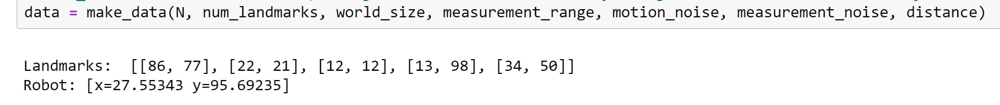
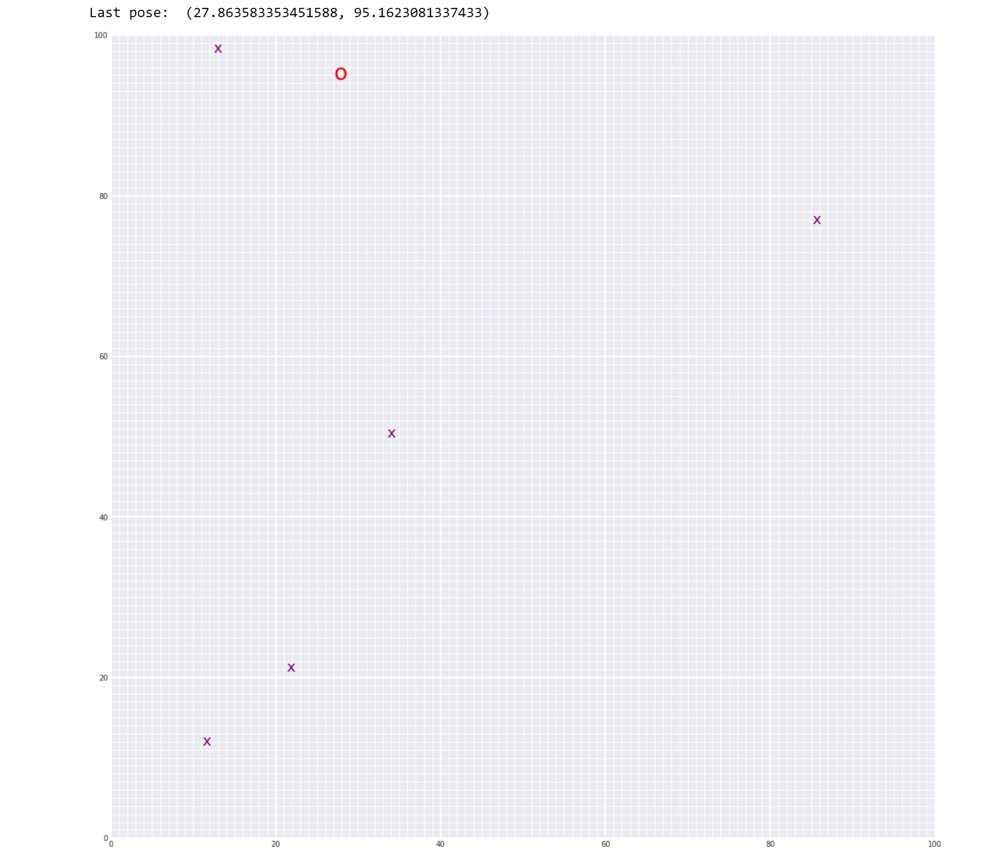

# Robot Localization and Landmark Detection Using Graph SLAM

*SLAM implemented by a robot in a abandoned underground cave in Pennsylvania.*

## Objective

In this project, I have implemented Graph SLAM in a 2D grid world where the robot tracks it's movements and detects the surrounding landmarks such as building, trees, rocks etc using its distance measurement sensors and motion poses.

## Project Walkthrough

### 1. Define robot variables and create data:

First we define variables with respect to the world and the robot. The variables that I have used are the following:

- `--N`: time steps for which we want our robot to have a random walk
- `--num_landmarks`: number of landmarks in the world
- `--world_size`: the grid size of the world (Here I have taken it as 100 units (10x10))
- `--measurement_range`: the range in which the robot measures a landmark
- `--motion_noise`: noise or uncertanity present in the robot motion.
- `--measurement_noise`: noise or uncertanity present in the robot's distance measurement sensor. These two moise variables are introduced to mimick real-life sceanrios.
- `--distance`: distance by which a robot can move during a particular time step.

All of the above variables go into the `make_data()` function and out comes the true landmark locations and the robots final pose co-ordinates.

Here data[time_step][0] is the measurement values given by the robot sensor with respect to each landmark and data[time_step][1] is the motion co-ordinates of the robot.
Please see the helpers.py file for more info

Here I have instantiated the robot at the center of the grid.

Also, the function `sense()` in the 1st notebook measures the distance from the robot to the landmarks around it in it's range. This funtion acts as the distance measuring sensor of the robot.

### 2. Omega and Xi:

Please go thorugh the 2nd notebook to understand the concept before you go further. It is very important.

### 3. Implementation:

The concept in the 2nd notebook explains the motion of the robot in 1D and gives an overview of how it can be done it 2D. Accordingly I have coded the workflow in 2D which defined in the `slam()` function in the 3rd notebook.

## Results

 # width="80%" height="80%">

As you can see the red circle is the robot and the purple cross marks are the landmarks. The co-orindates of the last pose of the robot are mentioned after N time steps. We can compare this value with the output robot position value of the `data` and can see the they are not exactly they same. The error is due to the noise that I have introduced in the robot motion and the sensor.